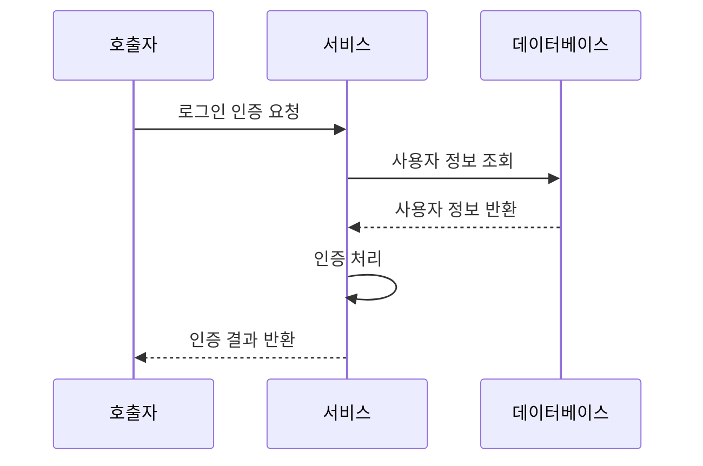
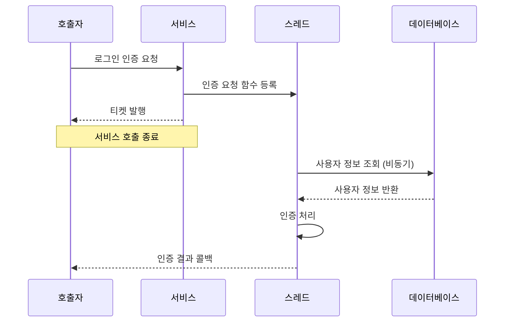

# 동기와 비동기

[자바 네트워크 소녀 Netty](https://product.kyobobook.co.kr/detail/S000001057642)

Netty 홈페이지에 접속하면 이런 문구가 있다.
 

| *네티는 비동기와 이벤트 기반 네트워크 애플리케이션 프레임워크로써 유지 보수를 고려한 고성능 프로토콜 서버와 클라이언트를 개발할 수 있다.*

이 중에 동기와 비동기에 대해서 먼저 알아보자!

동기, 비동기 단어는 매우 일반적인 단어라서 의미가 매우 넓다. 우리가 알아볼 동기와 비동기는 함수 또는 서비스의 호출 방식에 관련된 것이다.

### 동기
먼저 로그인 인증을 한다고 생각해보자. 동기 방식으로 호출한다면 이런식으로 동작할 것이다.

서비스 호출자는 호출이 종료된 이후에 처리 결과를 확인할 수 있다. 
이런 동기 방식의 호출은 디버깅이 편하고, 직관적인 흐름 추적이 가능해진다.

### 비동기

비동기식 호출에서는 호출자의 인증 요청을 서비스가 수신한다. 서비스는 스레드에 인증 요청을 위한 함수를 다른 스레드에 등록한다. 그리고 실제 인증 처리가 완료되지 않았음에도 서비스 호출 종료가 이루어진다. 그리고 그 응답으로 티켓을 발행한다.

호출자 관점에서는 비록 인증 요청에 대한 결과를 수신하지 못했음에도 인증 요청이 완료되었기 때문에 인증 요청 결과를 기다리는 시간에 다른 작업이 가능하다.
