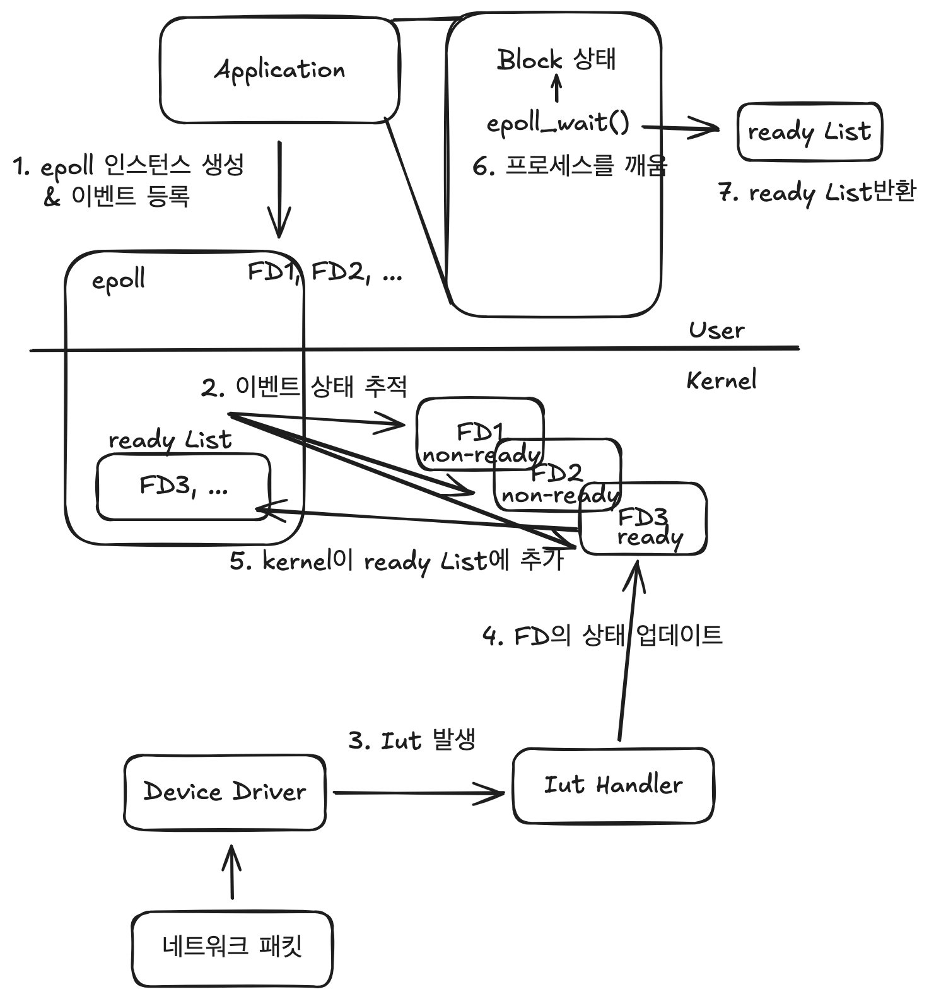

# epoll 그리고 io_uring

[epoll 과 io_uring 성능 비교 - 이희승님 라이브](https://www.youtube.com/live/PsF9EeYndd4?si=VhSGrvbz-8Dp0NKS)

네티를 공부하다보면 epoll에 대한 언급이 진짜 많이 나올 것이다. 

대부분은 깊게 파보지 않고 그냥 넘어간다. 하지만 내 개인적인 생각으로는 epoll에 대해 자세히 모른다면 Netty를 제대로 공부할 수 없다고 생각한다.

Netty는 Java NIO패키지 기반으로 만들어졌지만, JNI를 이용해 epoll호출을 추상화하였다. 

즉, Netty는 epoll기반으로도 동작한다. (리눅스 환경에서)

그렇다면 epoll이란 무엇이고 어떻게 동작하는 것일까?

epoll을 알기전에 I/O multiplexing에 대해 살펴보자.

 

## I/O multiplexing

만약 어플리케이션에서 커널에 I/O요청을 한다고 생각해보자. 

만약 blocking 방식으로 동작하면 이런식일 것이다.

위 시퀀스 다이어그램을 보면 I/O의 결과를 받기 전까지 어플리케이션은 CPU를 계속 점유하고 있을 것이다. 그것도 대기만 하기위해서.

위 방식을 I/O blocking model 이라 한다.

그렇다면 nonblocking 방식으로 한번 바꾸어보자.

커널에 System Call을 보내고, 애플리케이션은 다른일을 한다.

다른 일을 하는 동안 계속, 커널에 완료가 되었는지 물어보는 것이다.

이를 I/O nonblocking model이라 한다.

하지만 이 방식도 비효율적이다. 

그냥 커널에 일을 시키고, ready가 된 상태를 애플리케이션에 알려주면 안될까?

이 방식이 바로 I/O multiplexing model이다.

이때 사용나는 리눅스 API로는 select, poll, epoll이 있다. 

그 중 epoll이 가장 효율적이고, 비용이 가장 적은 방식이다.

epoll 인스턴스를 생성하고 관심있는 FD 이벤트들을 등록한다. 그리고 해당 이벤트가 발생되면 애플리케이션에 알려주는 것이다.

어떻게 그 방식이 되는 걸까?

 

## epoll

네트워크 작업을 처리하는 epoll에 대해 살펴보자!

그러면 아래와 같은 순서로 처리가 된다.
여기에서 말하는 blocking은 CPU를 점유하고 있지 않은 상태이다.

1. 이벤트 등록: 애플리케이션이 epoll 인스턴스를 생성하고 관심 있는 파일 디스크립터(이하 FD)들을 등록한다.
2. 커널은 epoll을 위한 내부 데이터 구조를 유지한다. 이 구조는 감시 중인 FD들과 FD들의 이벤트 상태를 추적한다.
3. 하드웨어 이벤트(ex 네트워크 패킷 도착)가 발생하면 해당 디바이스 드라이버가 인터럽트를 발생시킨다.
4. 커널의 인터럽트 핸들러가 이 인터럽트를 처리한다. 이 과정에서 관련 FD의 상태가 업데이트 된다.
5. FD가 ready상태가 되면, 커널은 이를 epoll의 ready리스트에 추가한다.
6. epoll_wait()호출로 blocking된 프로세스가 있다면, 커널은 이 프로세스를 깨운다.
7. 프로세스가 깨어나면, epoll_wait()는 ready상태의 FD리스트를 반환한다.

따라서 epoll을 사용하는 event loop는 아래와 같이 동작한다.

1. Selector 초기화: EventLoop가 시작될 때 Selector(epoll)를 초기화 한다.
2. FD 등록: 관심 있는 디스크립터를 epoll에 등록한다. 각 FD에 대해 어떤 이벤트를 감시할지 지정한다.
3. epoll_wait()호출: EventLoop의 주 루프에서 epoll_wait()를 호출한다. 이 호출은 이벤트가 발생할 때 까지 blocking 된다.
4. 커널의 이벤트 감지: 커널은 등록된 FD들의 상태를 모니터링 한다. 이벤트 발생 시 FD를 ready상태로 표시!
5. 프로세스 깨우기: 커널이 하나 이상의 FD가 ready 상태가 되면, epoll_wait()를 호출한 프로세스를 깨운다.
6. Ready List 반환: epoll_wait()는 ready상태인 FD들의 리스트를 반환한다.
7. 이벤트 처리: EventLoop는 반환된 ready list를 순회하면서 각 FD에 해당하는 handler를 호출한다.
8. 루프 반복: 모든 ready 이벤트를 처리한 후, EventLoop는 다시 epoll_wait()를 호출하여 새로운 이벤트를 기다린다.

그런데 이 epoll도 사실 비효율적인 면이 있다.

바로 이미 존재한 파일 읽기 이벤트를 등록하면 바로 ready상태가 된다. (이미 존재하기에)
버퍼에 먼저 기록하고, 버퍼에 다 기록하고 ready상태가 된다면 더 효율적이지 않을까?

그리고 system call을 바로바로 호출한다. 이것도 버퍼에 기록해서 한꺼번에 넘겨주면 더 효율적이지 않을까?

그래서 io_uring이라는 API가 등장하게 된다.

 

## io_uring

io_uring은 Jens Axboe라는 사람이 제안하여 만들어지게 되었다. io_uring은 ring buffer를 사용한다.

이 버퍼는 커널과 유저가 공유하게 된다.

버퍼는 2가지 종류가 있다.

Submission Queue(SQ)와 Completion Queue(CQ)가 존재한다.

**Submission Queue(SQ)**
이 버퍼는 event들을 저장하는 버퍼이다. 유저에서는 이 버퍼에 event를 기록하고 커널에서는 이 버퍼에 있는 event들을 처리한다.
커널이 이 버퍼에 있는 내용을 실행하게 할때는 유저가 지정할 수 있고, 자동으로 poll하면서 가져올 수도 있다.

**Completion Queue(CQ)**
이 버퍼에는 수행완료된 내용을 기록하게 된다. 따라서 하나의 Submission Queue에는 하나의 Completion Queue가 있다.

그리고 이 버퍼들을 커널과 유저가 서로 공유하기때문에 zero copy이다.

io_uring의 장점:
1. 성능이 좋다: zero copy랑 한번에 여러 작업을 처리해서 시스템 콜 부르는 횟수를 줄인다.
2. 비동기 I/O: 복잡한 비동기 작업을 쉽게 할 수 있다.
3. 여러 가지로 쓸 수 있다: 읽기, 쓰기, fsync 같은 여러 I/O 작업을 하나의 방식으로 처리할 수 있다.

io_uring은 리눅스 커널 5.1 버전부터 들어갔고, 계속 좋아지고 있다.

 

## Netty의 workerGroup의 default값

Netty의 workerGroup의 eventLoop default 값은 CPU 코어 수 × 2이다.

이는 epoll의 비효율적인 동작 방식 때문에 blocking되는 상황을 고려하여 보정 처리하기 위해서이다. (이희승님 라이브 방송에서 언급)

그런데 Netty에 io_uring을 사용할 때 이 default 값은 오히려 독이 될 수 있다.

io_uring은 효율적으로 동작하기 때문에 오히려 스레드 간의 경쟁이 일어나서 오버헤드가 더 클 수 있다.

따라서 Netty에서 io_uring을 사용할 때는 workerGroup을 CPU 코어 개수 그대로 설정해주는 것이 좋다고 한다.

이러한 설정 차이는 Netty의 성능과 리소스 사용에 큰 영향을 미칠 수 있으므로, 사용 환경에 맞는 적절한 설정이 중요하다.
